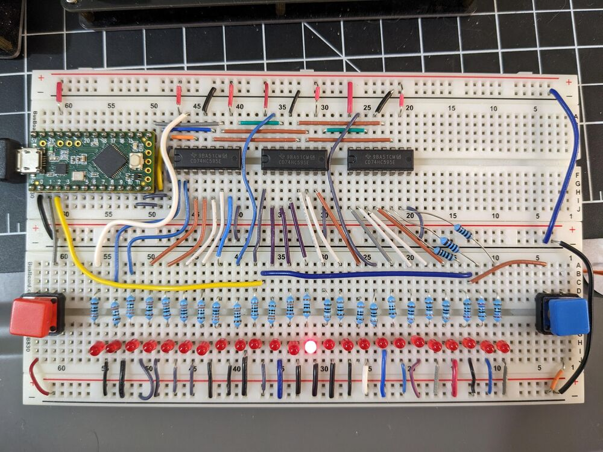

# Tug-o-war

This is a 74HC595 shift register exercise.

SPI0 is used to control three 595 ICs that are chained together to form one 24-bit register.

Each output drives its own LED and the 24 LEDs are arranged in a long line.

## Basic tug-o-war game

Only one LED is illuminated at a time.

Two buttons at each end of the line of LEDs are the game inputs.

Pressing a button causes the illuminated LED to move closed to that button.

The first player to bring the illuminated LED all the way to their end of the line wins.

## Variation ideas

### Extra button inputs

Adding another button would allow for sequence like A -> B -> A -> B to move the LED.

### Timing challenges

Press and hold to charge up? Hold to long and you lose ground?
